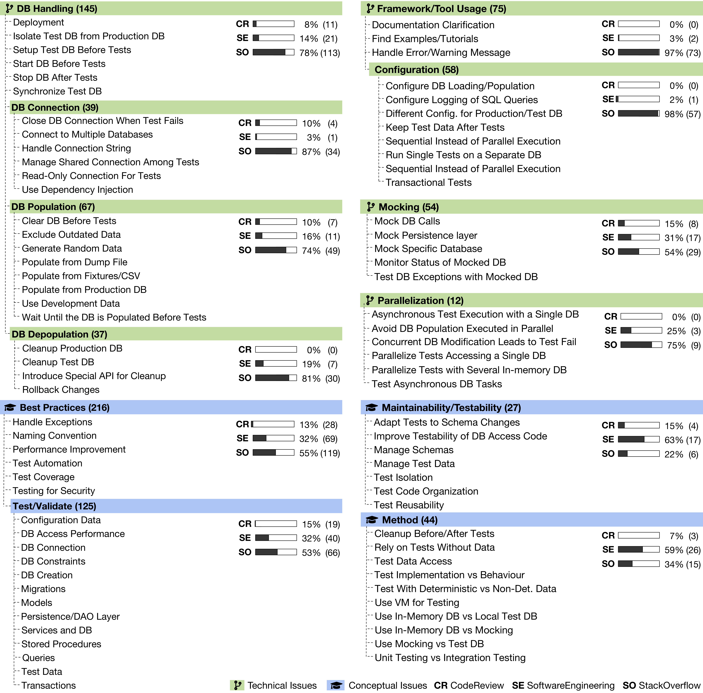

# DB Access Code Testing

Replication package for the paper entitled "Challenges and Perils of Database Access Code Testing: an Exploratory Analysis."

## RQ1: How do developers test database access code?

Scripts and data used for the research question.

## RQ2: What are the main challenges/problems when testing database access code?

The final classification for the research question.

- [Summary of labels](rq2_problems/category_summary.csv)
- [StackExchange questions and their final labels](rq2/question_categories.csv)

